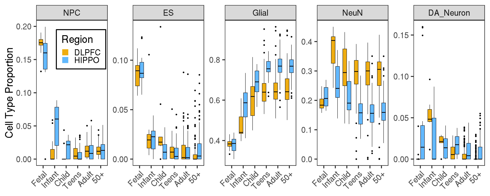
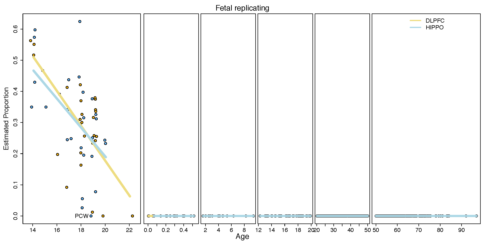
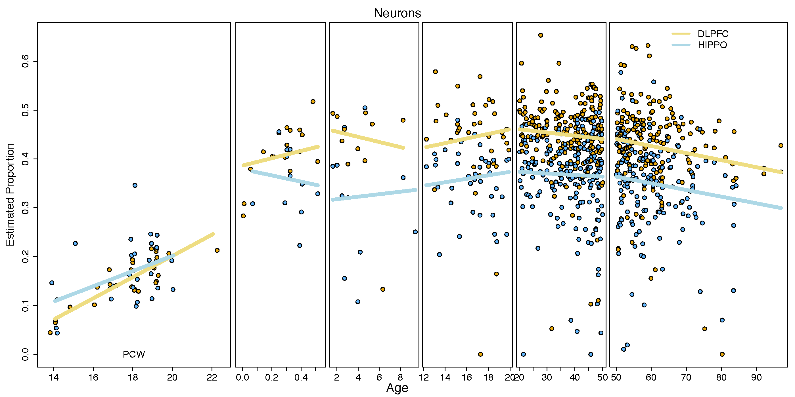

Estimated cell type RNA fractions
=================================

We have now performed RNA deconvolution as the main analysis and then used the DNAm-based deconvolution as replication. We have therefore updated Figure 2A (shown below) to show the "fetal quiescent neurons" (FQN), neuron and oligodendrocyte RNA fractions as defined by [Darmanis et al., PNAS, 2015](https://www.pnas.org/content/112/23/7285). We further show the associations between all RNA fractions and DNAm-estimated fractions versus age and brain regions (which was contained in the original Figure 2A), including RNA from eight different cell types (fetal replicating neurons, fetal quiescent neurons, OPC, neurons, astrocytes, oligodendrocytes, microglia and endothelial cells) from the RNA-seq data and 5 cell types from the DNAm data.

## Cell types by age group

### RNA fraction

### DNAm

This is with a subset of samples that have matching DNAm data.

## Cell types RNA fraction over age

