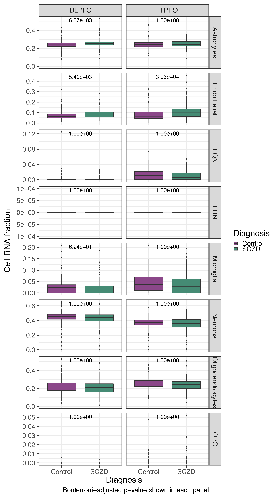
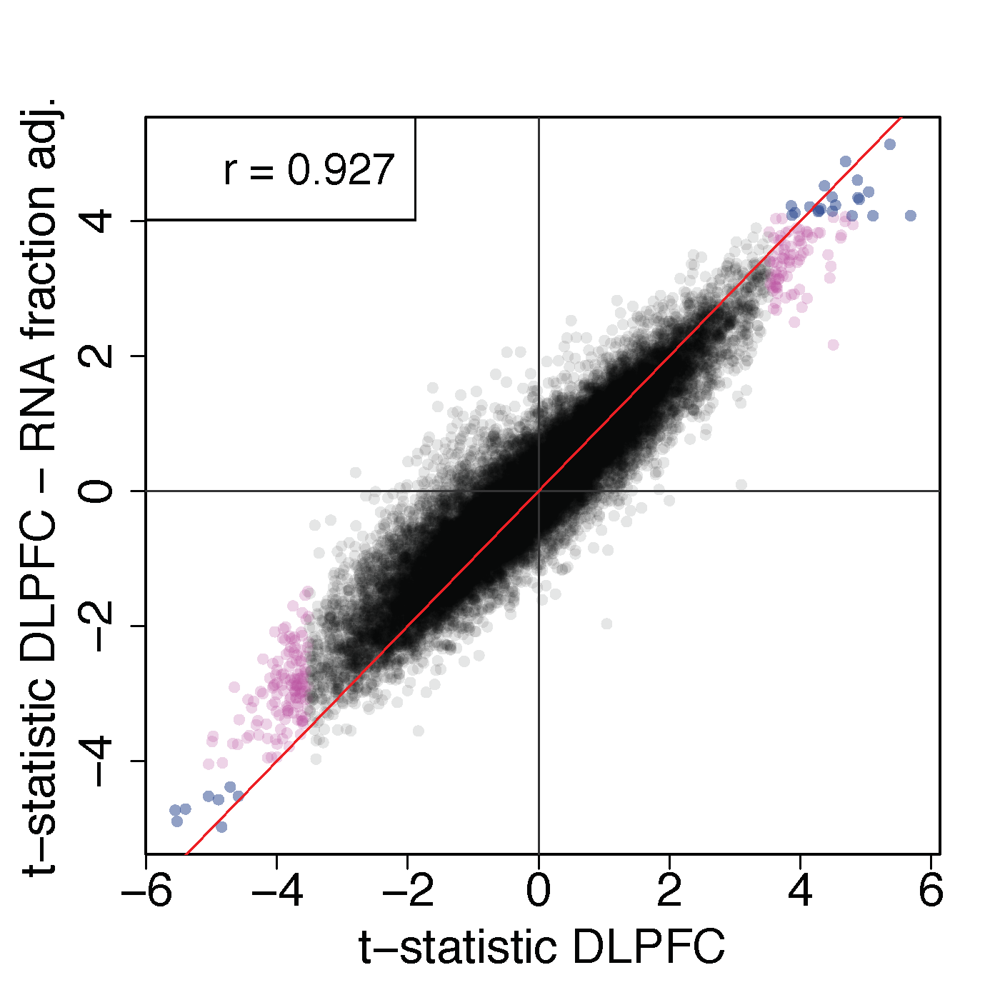
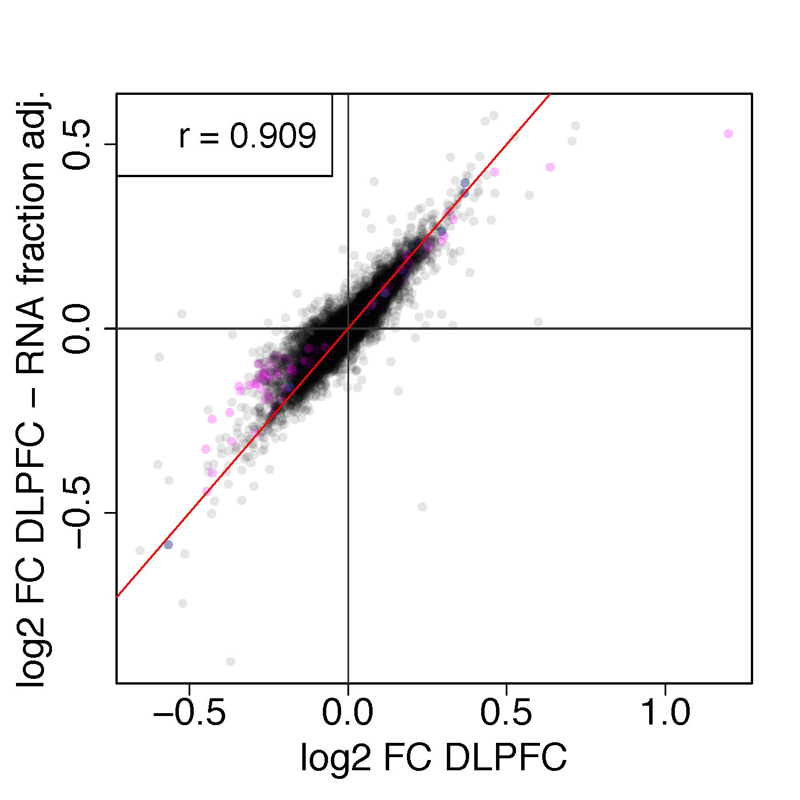
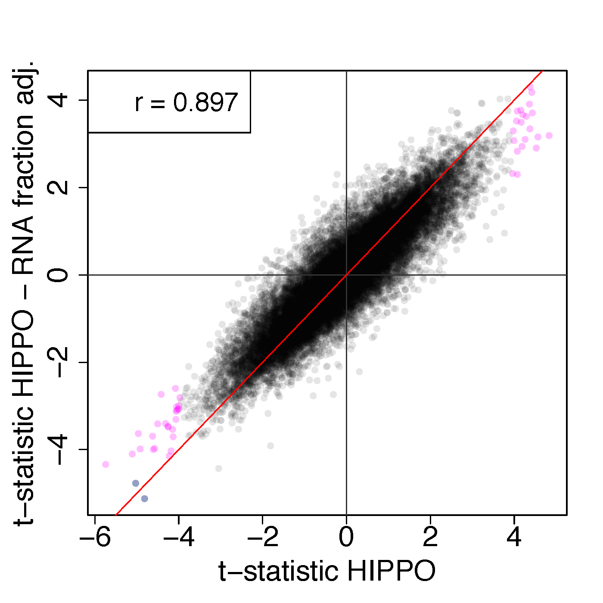
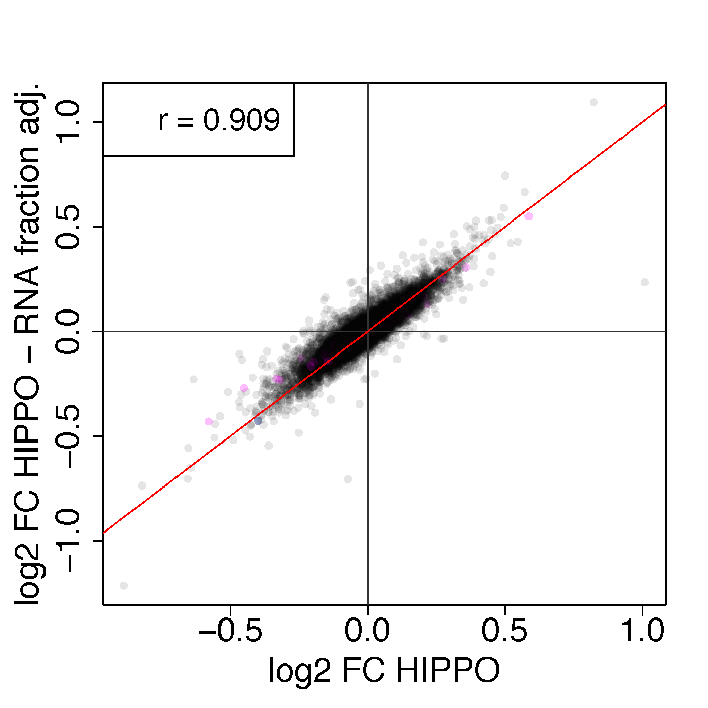
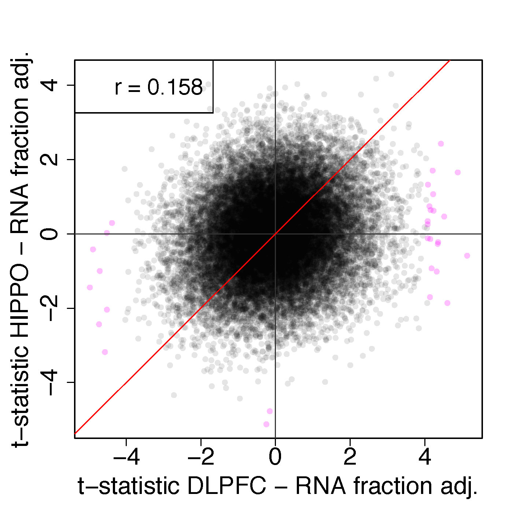
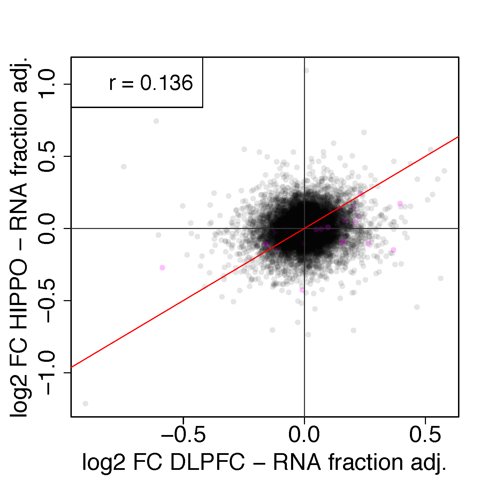

Cell RNA fraction by SCZD diagnosis check
=========================================

We assessed if there were differences in the cell type RNA fractions between patients with schizophrenia and unaffected controls in DLPFC and HIPPO using the same samples we used for the case-control differential expression analysis. We found significant differences (P-bonferroni<5%, see Table 1 below) in endothelial and astrocytes (only in DLPFC) fractions (Figure 1 and Table 1 below). For the 15 DLPFC quality surrogate variables (qSVs) and the 16 HIPPO qSVs we determined if they were significant (P-bonferroni<5%) associated with each of the eight cell RNA fractions (See Figure 2 below). All cell types except fetal replicating neurons (FRN) were associated with at least one qSV in either brain region (See Table 2 below) and all qSVs associated with at least one RNA fraction in both DLPFC and HIPPO (See Table 3 below). Table 4 below shows the adjusted R-squared for each RNA fraction and brain region for the linear model using all qSVs as explanatory variables for each RNA fraction. Thus, we conclude that our original SCZD case-control analysis adjusting for the quality surrogate variables already incorporated RNA fraction information. As a sensitivity analysis, we found that the original SCZD case-control t-statistics and log2 fold changes and those computed while adjusting for six cell RNA fractions (all but FRN and FPN, for tractability of the model) were highly correlated (Figure 3 below) at the gene expression feature level.

## Figure 1

RNA fractions by SCZD case-status.




## Table 1

First we show the full table, then just the subset of the table that is P-bonferroni <5%.

```{r}
dx_lm
#               term      estimate    std.error    statistic      p.value          celltype region       p.bonf        p.fdr
# 2  SCZD_versus_Ctrl  8.460423e-21 9.584524e-19  0.008827171 9.929617e-01 Fetal_replicating  DLPFC 1.0000000000 0.9929616972
# 4  SCZD_versus_Ctrl -8.344877e-05 7.973923e-04 -0.104652081 9.167075e-01   Fetal_quiescent  DLPFC 1.0000000000 0.9825230827
# 6  SCZD_versus_Ctrl -3.609359e-06 3.642317e-05 -0.099095153 9.211154e-01               OPC  DLPFC 1.0000000000 0.9825230827
# 8  SCZD_versus_Ctrl -1.372423e-02 8.837534e-03 -1.552948380 1.212745e-01           Neurons  DLPFC 1.0000000000 0.2771988785
# 10 SCZD_versus_Ctrl  1.756957e-02 4.899042e-03  3.586328100 3.795030e-04        Astrocytes  DLPFC 0.0060720474 0.0020240158
# 12 SCZD_versus_Ctrl -1.118253e-02 7.903716e-03 -1.414844939 1.579394e-01  Oligodendrocytes  DLPFC 1.0000000000 0.3158787616
# 14 SCZD_versus_Ctrl -6.695610e-03 3.232257e-03 -2.071497030 3.899208e-02         Microglia  DLPFC 0.6238732297 0.1559683074
# 16 SCZD_versus_Ctrl  1.411986e-02 3.902716e-03  3.617957417 3.373895e-04       Endothelial  DLPFC 0.0053982313 0.0020240158
# 18 SCZD_versus_Ctrl -1.398931e-18 1.104318e-18 -1.266782755 2.061236e-01 Fetal_replicating  HIPPO 1.0000000000 0.3235014200
# 20 SCZD_versus_Ctrl -1.550131e-03 1.474590e-03 -1.051227996 2.939207e-01   Fetal_quiescent  HIPPO 1.0000000000 0.3918943260
# 22 SCZD_versus_Ctrl  6.222622e-04 5.090287e-04  1.222450054 2.224072e-01               OPC  HIPPO 1.0000000000 0.3235014200
# 24 SCZD_versus_Ctrl -1.603955e-02 9.939538e-03 -1.613712084 1.075428e-01           Neurons  HIPPO 1.0000000000 0.2771988785
# 26 SCZD_versus_Ctrl  4.435471e-03 4.569658e-03  0.970635199 3.324387e-01        Astrocytes  HIPPO 1.0000000000 0.4091553311
# 28 SCZD_versus_Ctrl -1.193916e-02 7.236380e-03 -1.649880355 9.991600e-02  Oligodendrocytes  HIPPO 1.0000000000 0.2771988785
# 30 SCZD_versus_Ctrl -5.717071e-03 4.618348e-03 -1.237903900 2.166290e-01         Microglia  HIPPO 1.0000000000 0.3235014200
# 32 SCZD_versus_Ctrl  3.018818e-02 7.053807e-03  4.279701025 2.453508e-05       Endothelial  HIPPO 0.0003925612 0.0003925612
subset(dx_lm, p.bonf < 0.05)
#               term   estimate   std.error statistic      p.value    celltype region       p.bonf        p.fdr
# 10 SCZD_versus_Ctrl 0.01756957 0.004899042  3.586328 3.795030e-04  Astrocytes  DLPFC 0.0060720474 0.0020240158
# 16 SCZD_versus_Ctrl 0.01411986 0.003902716  3.617957 3.373895e-04 Endothelial  DLPFC 0.0053982313 0.0020240158
# 32 SCZD_versus_Ctrl 0.03018818 0.007053807  4.279701 2.453508e-05 Endothelial  HIPPO 0.0003925612 0.0003925612
```

## Figure 2

RNA fractions against qSVs for either DLPFC or HIPPO. Panels in red are significant (P-bonferroni <5%).


## Table 2

```{r}
with(subset(sczd_qsv, p.bonf < 0.05 & term != '(Intercept)'), table(factor(celltype, levels = unique(sczd_qsv$celltype)), region))
#                 region
#                  DLPFC HIPPO
# FRN                  0     0
# FQN                  0     4
# OPC                  2     1
# Neurons              9    11
# Astrocytes           9    11
# Oligodendrocytes     9     9
# Microglia            8     6
# Endothelial          9    10
```

## Table 3

Number of significant associations by qSV with the eight different RNA fractions for each brain region. Note that DLPFC only has 15 qSVs versus the 16 in HIPPO.

```{r}
with(subset(sczd_qsv, p.bonf < 0.05 & term != '(Intercept)'), table(factor(term, levels = unique(sczd_qsv$term)[-1]), region))
#         region
#          DLPFC HIPPO
# qSVsPC1      4     5
# qSVsPC2      4     5
# qSVsPC3      3     3
# qSVsPC4      4     4
# qSVsPC5      3     4
# qSVsPC6      1     2
# qSVsPC7      3     3
# qSVsPC8      2     4
# qSVsPC9      5     2
# qSVsPC10     2     3
# qSVsPC11     1     1
# qSVsPC12     3     2
# qSVsPC13     3     5
# qSVsPC14     4     3
# qSVsPC15     4     4
# qSVsPC16     0     2
```

## Table 4

Adjusted R-squared per RNA fraction and brain region using all qSVs as explanatory variables.

```{r}
sczd_r_sq
#       r_squared          celltype region
# 1  -0.003581566 Fetal_replicating  DLPFC
# 2   0.041031538   Fetal_quiescent  DLPFC
# 3   0.165518855               OPC  DLPFC
# 4   0.917873885           Neurons  DLPFC
# 5   0.895389430        Astrocytes  DLPFC
# 6   0.725281891  Oligodendrocytes  DLPFC
# 7   0.417239966         Microglia  DLPFC
# 8   0.647175741       Endothelial  DLPFC
# 9   0.022929396 Fetal_replicating  HIPPO
# 10  0.289756469   Fetal_quiescent  HIPPO
# 11  0.033058682               OPC  HIPPO
# 12  0.948052921           Neurons  HIPPO
# 13  0.804310534        Astrocytes  HIPPO
# 14  0.734860107  Oligodendrocytes  HIPPO
# 15  0.559609755         Microglia  HIPPO
# 16  0.836349603       Endothelial  HIPPO

map(split(sczd_r_sq, sczd_r_sq$region), ~ summary(.x$r_squared))
# $DLPFC
#      Min.   1st Qu.    Median      Mean   3rd Qu.      Max.
# -0.003582  0.134397  0.532208  0.475741  0.767809  0.917874
#
# $HIPPO
#    Min. 1st Qu.  Median    Mean 3rd Qu.    Max.
# 0.02293 0.22558 0.64723 0.52862 0.81232 0.94805
```

## Figure 3

| t-statistic  | log2 fold change  |
|---|---|
|   |   |
|   |   |
|   |   |


