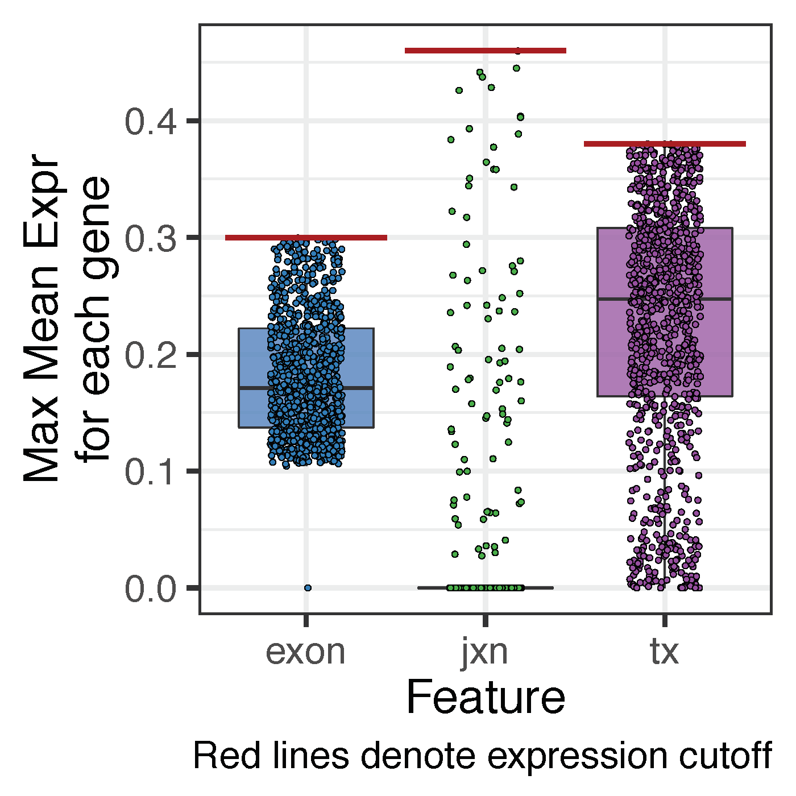

Check genes not expressed in other features
===========================================

As shown in Figure S4 (page 1 of this [pdf](https://github.com/LieberInstitute/brainseq_phase2/blob/master/development/pdf/venn_expressed_genes_ensembl_ids.pdf)), there are 955 genes expressed not observed in any of the other feature types. Of these, there are no exons or junctions for 1 (0.1%) and 868 (90.9%) of the genes. We verified that indeed the feature with the highest expression for each of these genes did not pass the feature-specific expression cutoffs (exon = 0.3 RPKM, junction = 0.46 RP10M, transcript = 0.38 TPM) as shown below.




The table below shows the gene type frequency and percent for each of these 955 genes. The majority of them are not protein coding, so it's unsurprising that the more fine-grained features are not expressed.

```{r}
#                                    gtype    percent
# processed_pseudogene                 415 43.4554974
# lincRNA                              160 16.7539267
# antisense                            110 11.5183246
# protein_coding                        68  7.1204188
# sense_intronic                        43  4.5026178
# unprocessed_pseudogene                37  3.8743455
# TEC                                   36  3.7696335
# miRNA                                 31  3.2460733
# transcribed_processed_pseudogene      22  2.3036649
# sense_overlapping                      8  0.8376963
# misc_RNA                               7  0.7329843
# snRNA                                  4  0.4188482
# processed_transcript                   3  0.3141361
# rRNA                                   3  0.3141361
# snoRNA                                 2  0.2094241
# IG_C_pseudogene                        1  0.1047120
# IG_V_pseudogene                        1  0.1047120
# non_coding                             1  0.1047120
# transcribed_unitary_pseudogene         1  0.1047120
# transcribed_unprocessed_pseudogene     1  0.1047120
# unitary_pseudogene                     1  0.1047120
```

The 955 genes themselves have low levels of expression with a range from 0.2501 to 0.679 mean RPKM (mean=0.369) when the cutoff at the gene level was 0.25 mean RPKM. We note that only 68 (7.1%) of these 955 genes are protein coding, in contrast with 415 (43.5%), 160 (16.8%) and 110 (11.5%) which are processed pseudogenes, lincRNAs or antisense. Thus, it is expected that the more fine-grained features (exon, junctions and transcripts) show even lower levels of expression.
