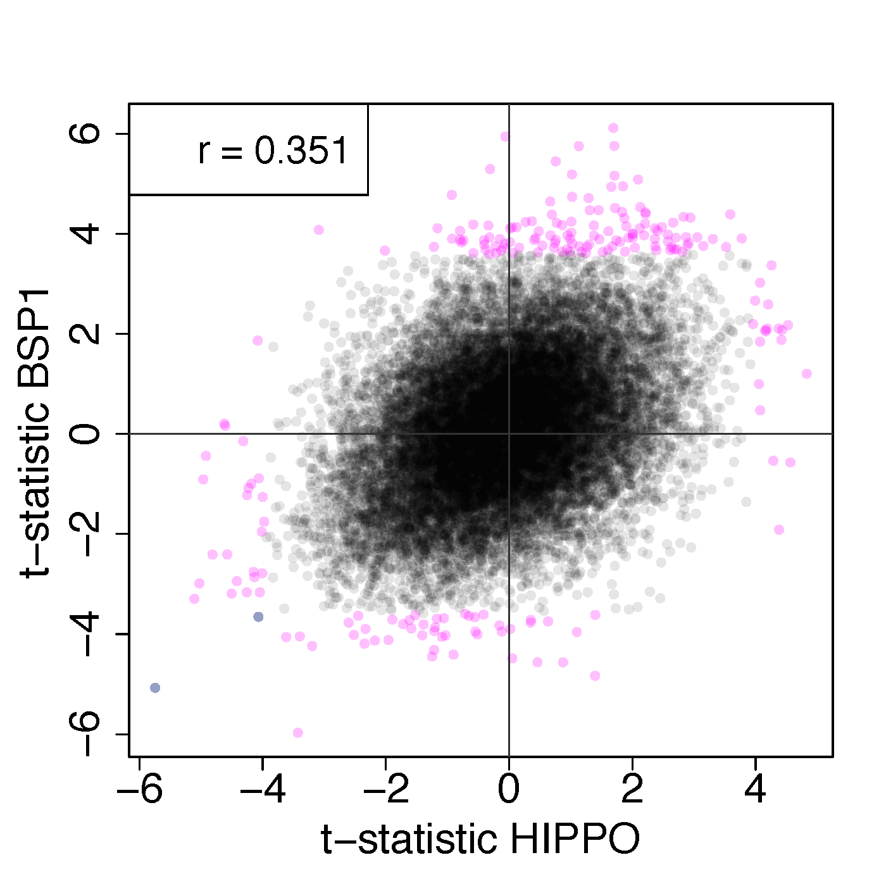
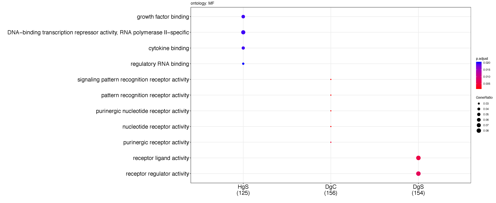

SCZD vs non-psychiatric controls without qSVA
=============================================

As a sensitivity analysis, we performed differential expression analysis between SCZD cases and non-psychiatric controls at the gene expression level without adjusting for the quality surrogate variables (qSVs). The t-statistics between SCZD cases and controls with and without qSVA adjustment were correlated (rho: HIPPO=0.72, DLPFC=0.74) with 8 out of 48 (16.7%) and 137 out of 245 (55.9%) significantly differentially expressed genes (FDR<5%) when adjusting for qSVs also being differentially expressed without qSVA adjustment, respectively in HIPPO and DLPFC. In both brain regions, though particularly in DLPFC, there was a higher number of genes at FDR<5% (HIPPO: 63 vs 48, DLPFC: 1,084 vs 245) in the analysis without qSVA adjustment compared to the original qSVA-adjusted analysis. The correlation of the t-statistics for each brain region against the CMC dataset (as previously analyzed in hg19) increases (HIPPO: 0.334 vs 0.0783, DLPFC: 0.306 vs 0.138) when not adjusting for qSVs compared to adjusting for them. Similarly, the correlation between DLPFC and HIPPO increases (0.564 vs 0.276) when not adjusting for qSVs. These observations could be a reflection of the confounding by degradation. These differences are further reflected in the gene set enrichment and gene ontology enrichment analyses results where we observe major differences in the enriched terms when not adjusting for qSVs. To facilitate the comparison of the results we include plots with and without qSVA adjustment further below.


```{r}
## Genes with FDR<5%
lapply(cross_tabs, addmargins)
# $HIPPO
#              HIPPO with qSVA
# HIPPO no qSVA FALSE  TRUE   Sum
#         FALSE 24549    40 24589
#         TRUE     55     8    63
#         Sum   24604    48 24652
#
# $DLPFC
#              DLPFC with qSVA
# DLPFC no qSVA FALSE  TRUE   Sum
#         FALSE 23460   108 23568
#         TRUE    947   137  1084
#         Sum   24407   245 24652
```


## With vs without qSVA

The following plots compare the SCZD vs control t-statistics for each region with and without qSVA adjustment at the gene expression level. Points in pink are significant (FDR<5%) in only one of the analyses, while those in blue are significant (FDR<5%) in both.

| HIPPO  | DLPFC  |
|---|---|
|   |   |

## HIPPO vs DLPFC

The following plots show the comparisons between HIPPO and DLPFC either adjusting for quality surrogate variables (qSVs) or without at the gene expression level.

| without qSVA  | with qSVA  |
|---|---|
|   |   |

## CMC

These plots show how each brain region compares against the CommonMind Consortium (CMC) data, with and without adjusting for qSVs. These plots are at the gene expression level.

| without qSVA  | with qSVA  |
|---|---|
|   |   |
|   |   |


## BSP1

These plots show how each brain region compares against BrainSeq Phase I DLPFC polyA+ data (BSP1), with and without adjusting for qSVs. These plots are at the gene expression level.

| without qSVA  | with qSVA  |
|---|---|
|   |   |
|   |   |

## Gene set enrichment

The following plots show the results from the gene set enrichment analysis for biological processes (BP), molecular functions (MF), cellular components (CC) and KEGG pathways with and without adjusting for qSVs.

### DLPFC

| without qSVA  | with qSVA  |
|---|---|
|   |   |
|   |   |
|   |   |
|  |   |


### HIPPO

| without qSVA  | with qSVA  |
|---|---|
|   |   |
|   |   |
|   |   |
|  |   |

## Venn genes DLFPC FDR<10% and HIPPO FDR<20%

Venn diagrams of the genes at FDR<10% for DLPFC and FDR<20% for HIPPO, with and without qSVA adjustment. First, for genes with higher expression in controls than SCZD, then the reverse.

| without qSVA  | with qSVA  |
|---|---|
|   |   |
|   |   |


## Enriched GOs

For the following plots, note that the analysis with qSVA was also performed at the exon and junction expression feature levels.

Abbreviations:

* H: HIPPO
* D: DLPFC

* g: gene
* e: exon
* j: junction

* C: Control > SCZD
* S: SCZD > control


### DLFPC FDR<10% and HIPPO FDR<20%

The following plots show the top enriched gene ontology terms with the DLPFC FDR<10% and the HIPPO FDR<20% features.

| without qSVA  | with qSVA  |
|---|---|
|   |   |
|   |   |
|   |   |
|  |   |


### Top 200 genes

The following plots show the top enriched gene ontology terms with the top 200 genes per brain region. This is more comparable across the sets with and without qSVA since there are more genes with FDR<10% in DLPFC and FDR<20% in HIPPO when you don't adjust for qSVs.

| without qSVA  | with qSVA  |
|---|---|
|   |   |
|   |   |
|   |   |
|  |   |
