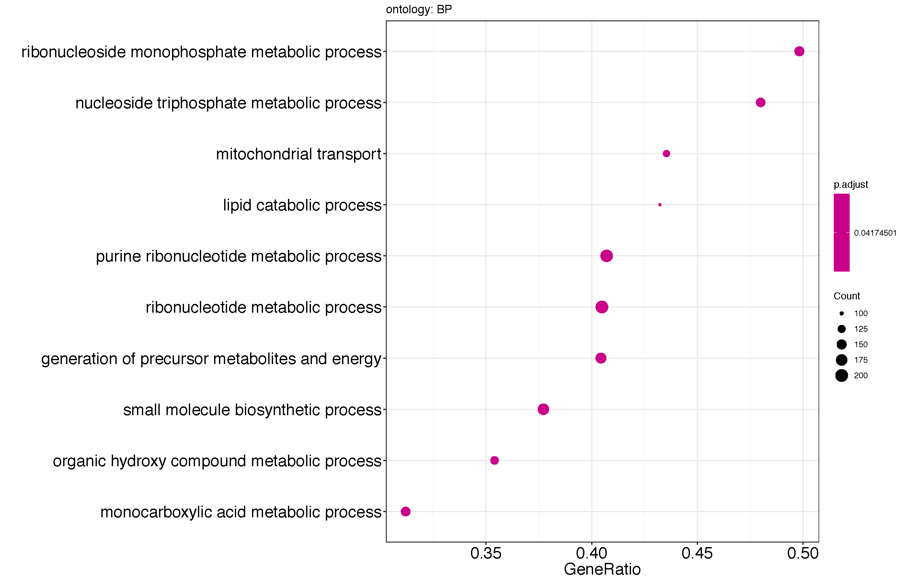
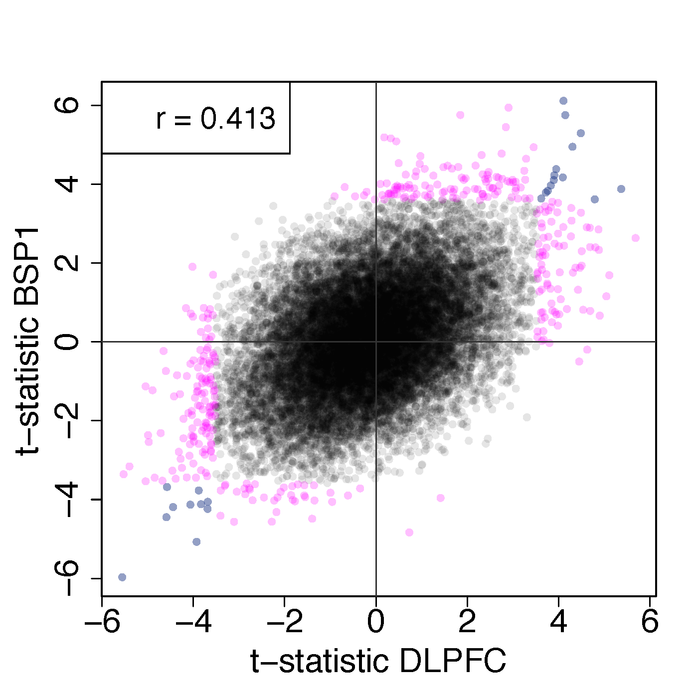
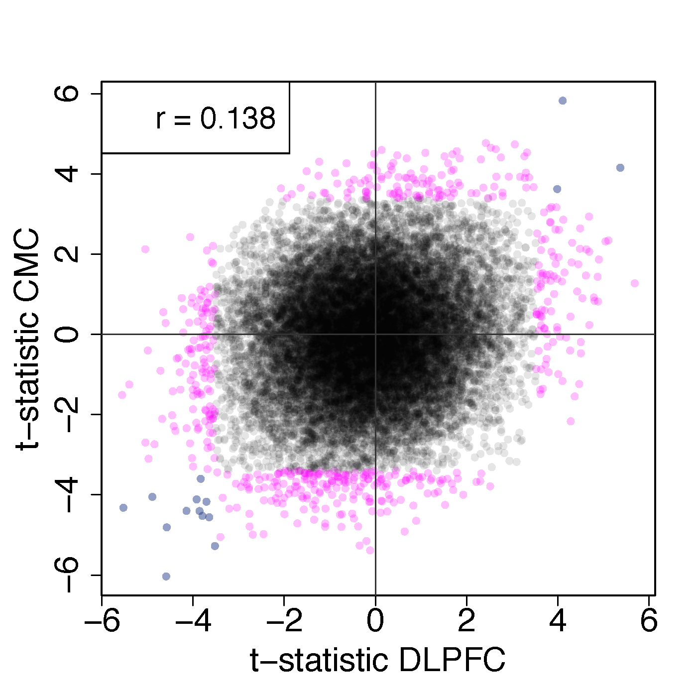

SCZD vs non-psychiatric controls without qSVA
=============================================

## With vs without qSVA

The following plots compare the SCZD vs control t-statistics for each region with and without qSVA adjustment at the gene expression level. Points in pink are significant (FDR<5%) in only one of the analyses, while those in blue are significant (FDR<5%) in both.

| HIPPO  | DLPFC  |
|---|---|
|   |   |

## HIPPO vs DLPFC

The following plots show the comparisons between HIPPO and DLPFC either adjusting for quality surrogate variables (qSVs) or without at the gene expression level.

| without qSVA  | with qSVA  |
|---|---|
|   |   |

## Gene set enrichment

The following plots show the results from the gene set enrichment analysis for biological processes (BP), molecular functions (MF), cellular components (CC) and KEGG pathways with and without adjusting for qSVs.

### DLPFC

| without qSVA  | with qSVA  |
|---|---|
|   |   |
|   |   |
|   |   |
|  |   |

### HIPPO

| without qSVA  | with qSVA  |
|---|---|
|   |   |
|   |   |
|   |   |
|  |   |

## Venn genes DLFPC FDR<10% and HIPPO FDR<20%

Venn diagrams of the genes at FDR<10% for DLPFC and FDR<20% for HIPPO, with and without qSVA adjustment. First, for genes with higher expression in controls than SCZD, then the reverse.

| without qSVA  | with qSVA  |
|---|---|
|   |   |
|   |   |

## Enriched GOs

### DLFPC FDR<10% and HIPPO FDR<20%

The following plots show the top enriched gene ontology terms with the DLPFC FDR<10% and the HIPPO FDR<20% features.

| without qSVA  | with qSVA  |
|---|---|
|   |   |
|   |   |
|   |   |
|  |   |

### Top 200 features

The following plots show the top enriched gene ontology terms with the top 200 features per brain region. This is more comparable across the sets with and without qSVA since there are more genes with FDR<10% in DLPFC and FDR<20% in HIPPO when you don't adjust for qSVs.

| without qSVA  | with qSVA  |
|---|---|
|   |   |
|   |   |
|   |   |
|  |   |

## BSP1 and CMC

These plots show how each brain region compares against BrainSeq Phase I DLPFC polyA+ data (BSP1) or the CommonMind Consortium (CMC) data, with and without adjusting for qSVs. These plots are at the gene expression level.

| without qSVA  | with qSVA  |
|---|---|
|   |   |
|   |   |
|   |   |
|   |   |

