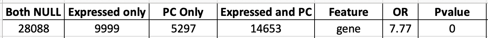
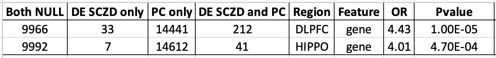

SCZD and protein coding gene check
==================================

BrainSeq Phase II RNA-seq data was prepared with a RiboZero library preparation protocol that allows preservation of non-coding RNA. We found that features passing our expression cutoffs are enriched for protein coding genes compared to the other 44 annotation categories that were all non-coding using Gencode v25. Overall, in the annotation, there were 19,950 protein coding genes out of 58,037 genes (34.4%), but 14,653 out of the 24,652 genes passing our expression cutoff were protein coding (59.4%). Unlike non-coding genes, the majority of protein coding genes pass the expression cutoff (73.4%, 14,653/19,950). In contrast the percent of lincRNAs retained decreased from 13% to 8% after the expression cuts with 1,965 (26.1%) out of 7,539 lincRNAs passing the expression cutoff (see [check_protein_coding.R](https://github.com/LieberInstitute/brainseq_phase2/blob/master/check_protein_coding/check_protein_coding.R#L99-L144) for more details). Below is the protein coding enrichment information at the gene feature level.

Among genes used for our SCZD case-control differential expression analysis (FDR <5%) in each brain region, we observe a significant enrichment (p-value <5%) for protein coding genes in the differentially expressed genes. 

At [check_protein_coding.R](https://github.com/LieberInstitute/brainseq_phase2/blob/master/check_protein_coding/check_protein_coding.R#L310-L354) we included the list of the 33 and 7 SCZD differentially expressed genes that are not protein coding in DLPFC and HIPPO respectively, including 11 lincRNAs in DLPFC. So, while these RiboZero datasets can quantify non-coding RNA, they were relatively depleted as a class compared to protein coding sequence. We have provided the `gene_type`  column for various differential expression analyses in [Supplementary Table 2](https://github.com/LieberInstitute/brainseq_phase2/tree/master/supp_tabs) which described the annotated gene class, allowing researchers to filter to non-coding sequence for specific hypotheses. We have also updated the eQTL browser to indicate the gene type. Given the relative depletion of non-coding sequence among DE results for schizophrenia, we have not emphasized these results in the main manuscript.