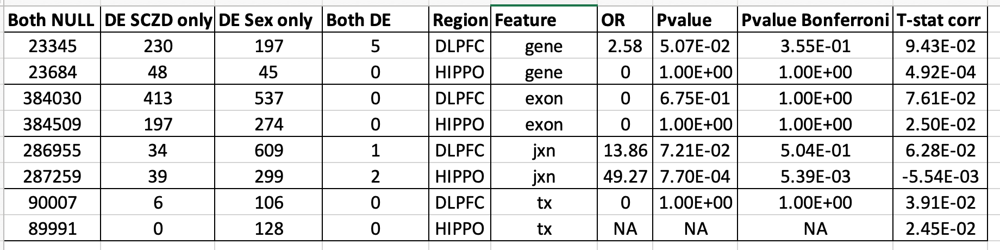
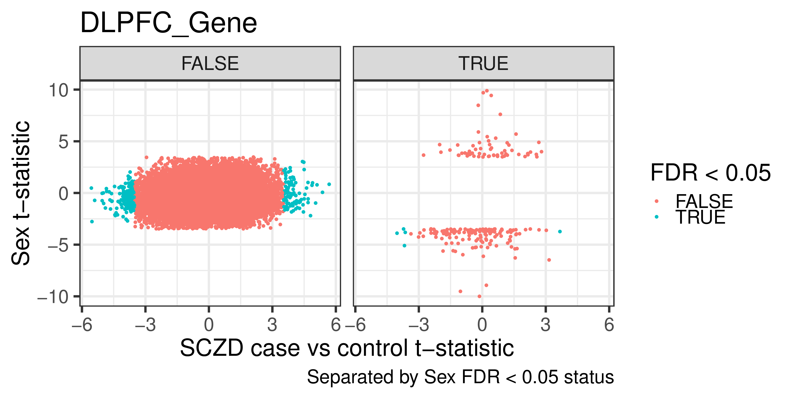
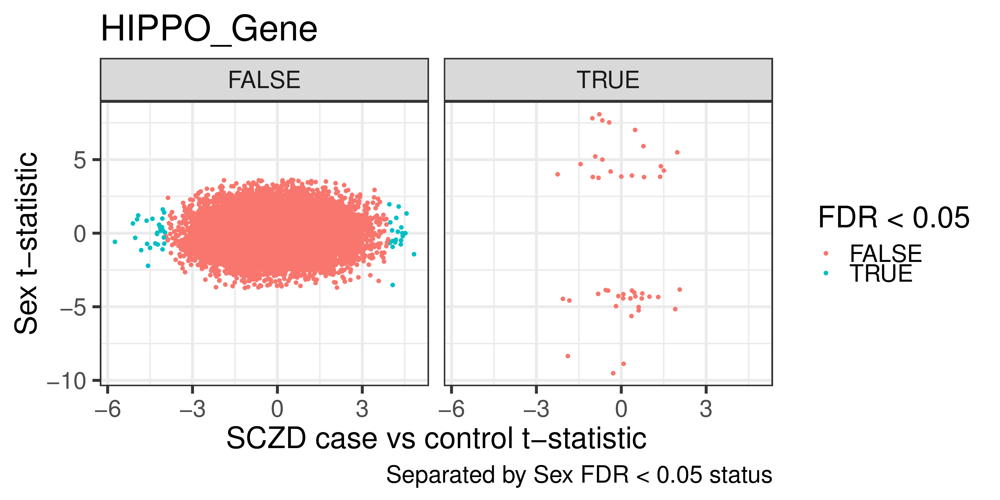
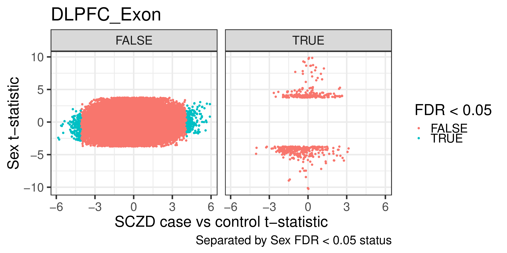
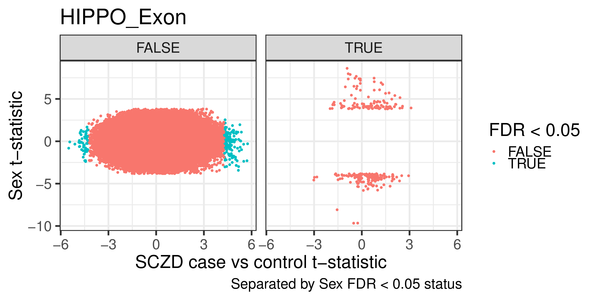
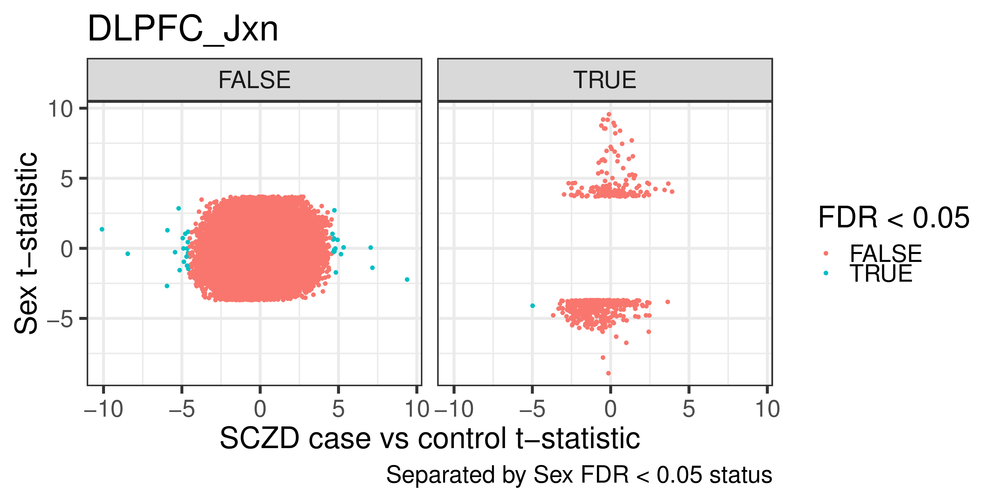
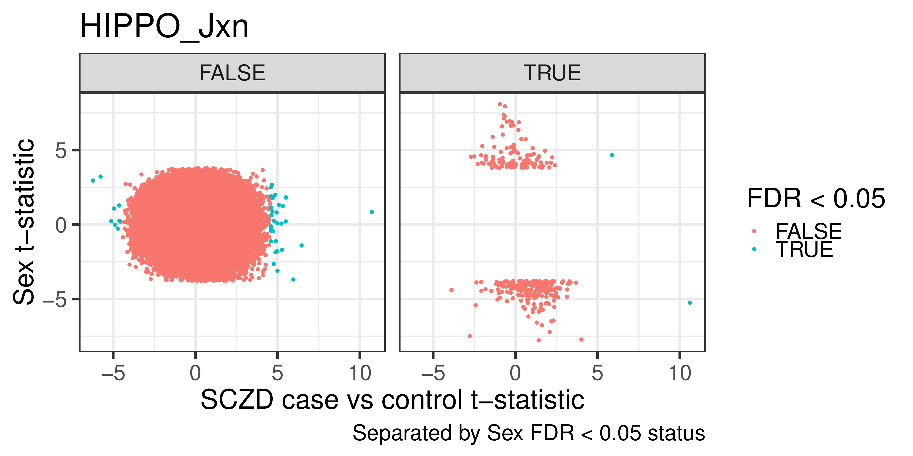
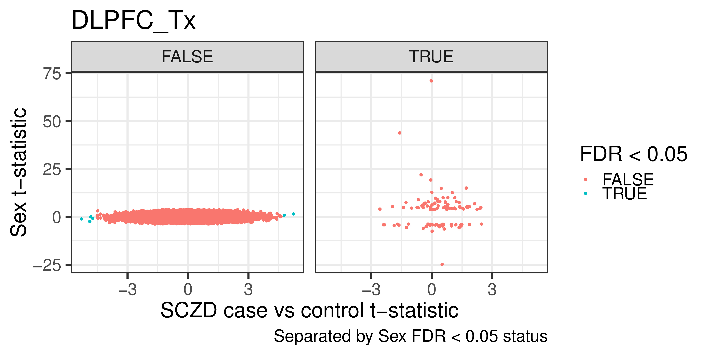
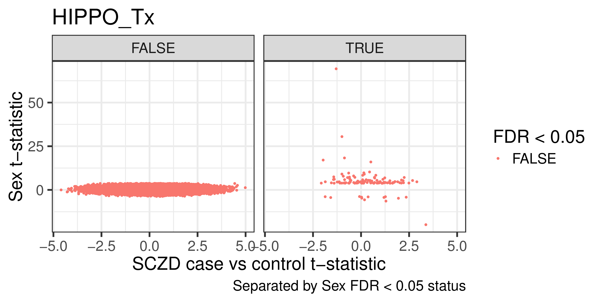

SCZD case-control sensitivity analysis by sex
=============================================

We performed differential expression analyses for sex for each brain region (FDR<5%) using the exact same samples we used for the SCZD case-control comparison. Focusing on features in the autosomal chromosomes, we found non-significant overlaps (chisq test, bonferroni p-value > 0.05) for nearly all features except for junctions in hippocampus (2 overlapped). These two junctions are novel junctions in the mitochondrial chromosome. Overall, the t-statistics from both models are uncorrelated as can be seen further below. Here's the overall summary:

## gene

## exon

## jxn

## tx

