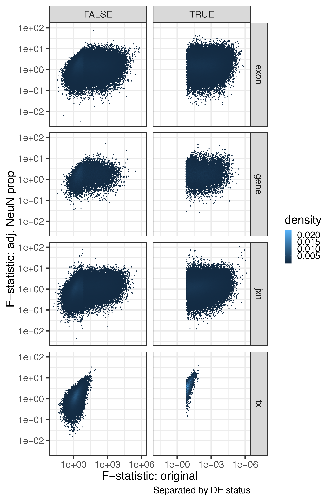

Check development after adjusting for NeuN cell type proportion
===============================================================


We used the estimated RNA fraction (see [cellComp](../../cellComp) directory) and re-ran our DEG analysis adjusting for the Neuronal estimated RNA fraction.


.... to be updated ...


We used 614 samples for the DEG analysis across development, out of which 412 had matching DNAm data and cell type proportion estimates. Using the 412 samples, we re-ran our DEG analysis adjusting for the NeuN estimated proportion. Across all features, we found a negligible amount of features with P-bonferroni <1% that don’t satisfy this threshold in the original model. In contrast, the great majority of features with P-bonferroni <1% in the original model failed to meet this threshold after adjusting for NeuN proportion. This result was significant across all features (largest p-value 3.859747 x 10-60). This result is in line with our previous work (Jaffe et al, Nat Neuro 2015) where we observed strong confounding by cell type across development.


....


The tables below show the number of features that are either null in both models, DE in the original model only, DE in the Neuron RNA fraction adjusted model only, or DE in both models where DE is assed by a P-bonferroni <1%. In the second table we additionally require that the DE call replicate in BrainSpan by having a P-value <5%.

```R
make_table(tab_pbonf)
#   Null_both Original_only NeuN_only   Both feature        OR pval pval_bonf
# 1      4566          1241      2341  16504    gene  25.93892    0         0
# 2     77518         19697     32226 267138    exon  32.62359    0         0
# 3     89159         15911     15635 176476     jxn  63.24926    0         0
# 4     88313           662       604   3153      tx 696.39185    0         0
make_table(tab_pbonf_span)
#   Null_both Original_only NeuN_only   Both feature        OR pval pval_bonf
# 1     12743           647      1070  10192    gene  187.6044    0         0
# 2    211284         10722     16042 158531    exon  194.7361    0         0
# 3    142089         12034     11197 131861     jxn  139.0481    0         0
# 4     90846           224       171   1491      tx 3536.2204    0         0
```

The following plot shows the F-statistics from the original model against the NeuN adjusted model with DE determined by P-bonferroni<1% and requiring replication in BrainSpan.


