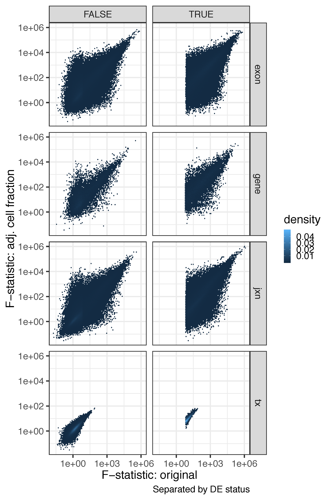

Check development after adjusting for RNA cell fractions
========================================================


We used the estimated RNA fractions (see [cellComp](../../cellComp) directory) for eight different cell types (fetal replicating, fetal quiescent, OPC, neurons, astrocytes, oligodendrocytes, microglia and endothelial cells). We then re-ran our DEG analysis for each expression feature adjusting for the first 7 cell types (to keep a full rank design model). Across features, we observed a high degree of concordance across our initial analysis and this re-analysis (see table below) at a threshold of Bonferroni<1%. This high concordance can be explained by the observation that, while the cell fractions are significantly different by brain regions, they are not significantly different (Bonferroni>5%) by age between DLPFC and HIPPO for each of the six age groups we considered, with the only exception being astrocytes for individuals 20 to 50 years old (details in `top_cell_by_agegroup` at [cellComp](../../cellComp), images at the end of this page). Thus while cell RNA fractions change over development, and have different means in each of the brain regions, they are not a confounding factor in our spline-based development analysis comparing DLPFC and HIPPO since the slopes within each age group are the same (even if they have different intercepts).


The tables below show the number of features that are either null in both models, DE in the original model only, DE only in the model where we adjust for the cell type fractions, or DE in both models where DE is assed by a P-bonferroni <1%. In the second table we additionally require that the DE call replicate in BrainSpan by having a P-value <5%.

```R
make_table(tab_pbonf)
#   Null_both Original_only CellProp_only   Both feature        OR pval pval_bonf
# 1      3878          1382          3029  16363    gene  15.15875    0         0
# 2     67292         24156         42452 262679    exon  17.23716    0         0
# 3     85447         26737         19347 165650     jxn  27.36289    0         0
# 4     88040          1049           877   2766      tx 264.70194    0         0
make_table(tab_pbonf_span)
#   Null_both Original_only CellProp_only   Both feature         OR pval pval_bonf
# 1     12501           748          1312  10091    gene  128.54155    0         0
# 2    206644         13333         20682 155920    exon  116.84341    0         0
# 3    139690         21195         13596 122700     jxn   59.47923    0         0
# 4     90783           408           234   1307      tx 1242.80816    0         0
```


The following plot shows the F-statistics from the original model against the RNA cell fractions adjusted model with DE determined by P-bonferroni<1% and requiring replication in BrainSpan.




## Cell types RNA fraction over age


