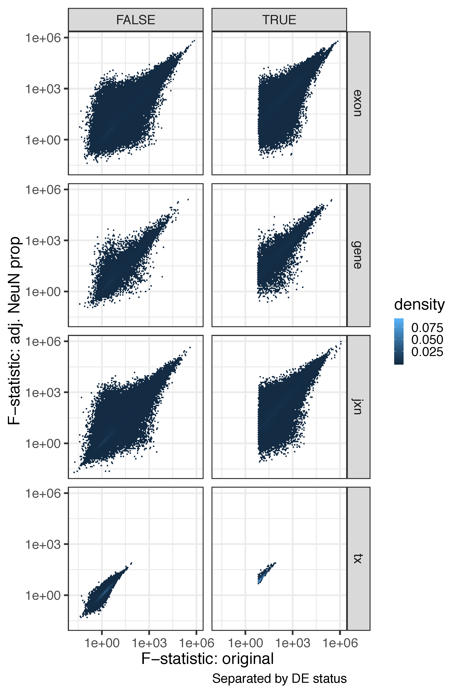

Check development after adjusting for NeuN cell type proportion
==============================================================

We used 614 samples for the DEG analysis across development, out of which 412 had matching DNAm data and cell type proportion estimates. Using the 412 samples, we re-ran our DEG analysis adjusting for the NeuN estimated proportion. Across all features, we found a negligible amount of features with P-bonferroni <1% that don’t satisfy this threshold in the original model. In contrast, the great majority of features with P-bonferroni <1% in the original model failed to meet this threshold after adjusting for NeuN proportion. This result was significant across all features (largest p-value 3.859747 x 10-60). This result is in line with our previous work (Jaffe et al, Nat Neuro 2015) where we observed strong confounding by cell type across development.

The tables below show the number of features that are either null in both models, DE in the original model only, DE in the NeuN-adjusted model only, or DE in both models where DE is assed by a P-bonferroni <1%. In the second table we additionally require that the DE call replicate in BrainSpan by having a P-value <5%.

```R
make_table(tab_pbonf)
#   Null_both Original_only NeuN_only Both feature         OR         pval    pval_bonf
# 1      6905         17061         2  684    gene 138.415685 3.859747e-60 1.157924e-59
# 2    104732        191304        62 1083     jxn   9.562955 2.838502e-99 8.515505e-99
# 3     88902          3345        15  470      tx 832.764126 0.000000e+00 0.000000e+00
make_table(tab_pbonf_span)
#   Null_both Original_only NeuN_only Both feature         OR          pval     pval_bonf
# 1     13813         10293         0  546    gene        Inf 2.916268e-156 8.748805e-156
# 2    153227        142957        59  938     jxn   17.04044 3.084074e-183 9.252221e-183
# 3     91012          1415         5  300      tx 3859.16608  0.000000e+00  0.000000e+00
```

The following plot shows the F-statistics from the original model against the NeuN adjusted model with DE determined by P-bonferroni<1% and requiring replication in BrainSpan.


