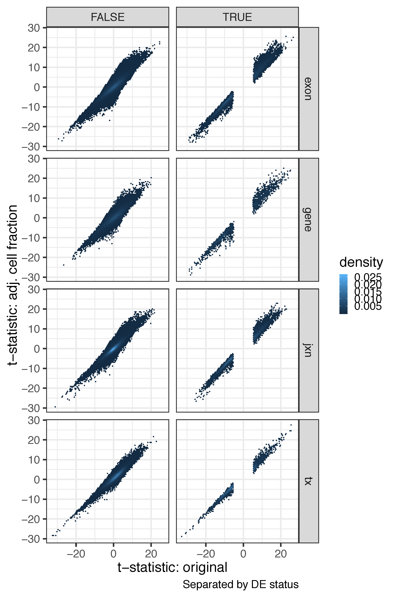

Check region differences in adults after adjusting for RNA cell fractions
=========================================================================


We used the estimated RNA fractions (see [cellComp](../../cellComp) directory) for eight different cell types (fetal replicating, fetal quiescent, OPC, neurons, astrocytes, oligodendrocytes, microglia and endothelial cells). We then re-ran our DEG analysis for each expression feature adjusting for the first 6 cell types (dropping fetal replicating and fetal quiescent neurons to keep a full rank design model). Across features, we observed a high degree of concordance across our initial analysis and this re-analysis (see table below) at a threshold of Bonferroni<1% for differences between DLPFC and HIPPO in adults.


The tables below show the number of features that are either null in both models, DE in the original model only, DE only in the model where we adjust for the cell type fractions, or DE in both models where DE is assed by a P-bonferroni <1%. In the second table we additionally require that the DE call replicate in BrainSpan by having a P-value <5%.

```R
make_table(tab_pbonf)
#   Null_both Original_only CellProp_only  Both feature        OR pval pval_bonf
# 1     15560          2000          1197  5895    gene  38.31504    0         0
# 2    301499         24048         12744 58288    exon  57.34299    0         0
# 3    256768         10988          4549 24876     jxn 127.78705    0         0
# 4     76355          4182          2337  9858      tx  77.01646    0         0
make_table(tab_pbonf_span)
#   Null_both Original_only CellProp_only  Both feature       OR pval pval_bonf
# 1     22844           107           196  1505    gene 1639.339    0         0
# 2    379246          2048          1891 13394    exon 1311.625    0         0
# 3    290973           887           647  4674     jxn 2369.810    0         0
# 4     90850           372           143  1367      tx 2334.611    0         0
```

## t-stats

The following plot shows the t-statistics from the original model against the RNA cell fractions adjusted model with DE determined by P-bonferroni<1% and requiring replication in BrainSpan.


