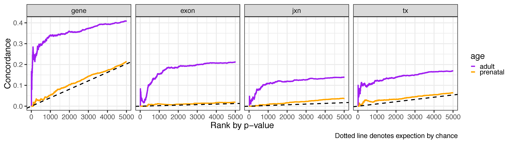
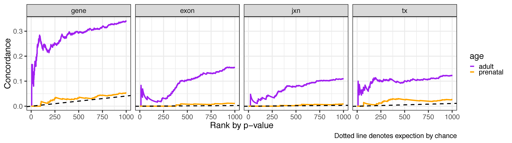

Check ranks across BSP2 and BrainSpan
=====================================

We computed ranks for each feature by age group (prenatal and adult) based on the p-values. We then visualized the concordance between BrainSeq Phase II and BrainSpan for the top 5,000 features and compared it against the expectation by chance. Across all features, the concordance was higher for the adult age group than the prenatal age group, although both showed higher concordance than expected by chance. The decreased concordance in the prenatal age group likely resulted from differences in prenatal dissections between the two studies. Our prenatal dissections contained adjacent parahippocampal neocortex (but not the amygdala), while the BrainSpan hippocampus dissections apparently did not include neocortex.

Below is the same plot zoomed in to the the top 1,000 features.

