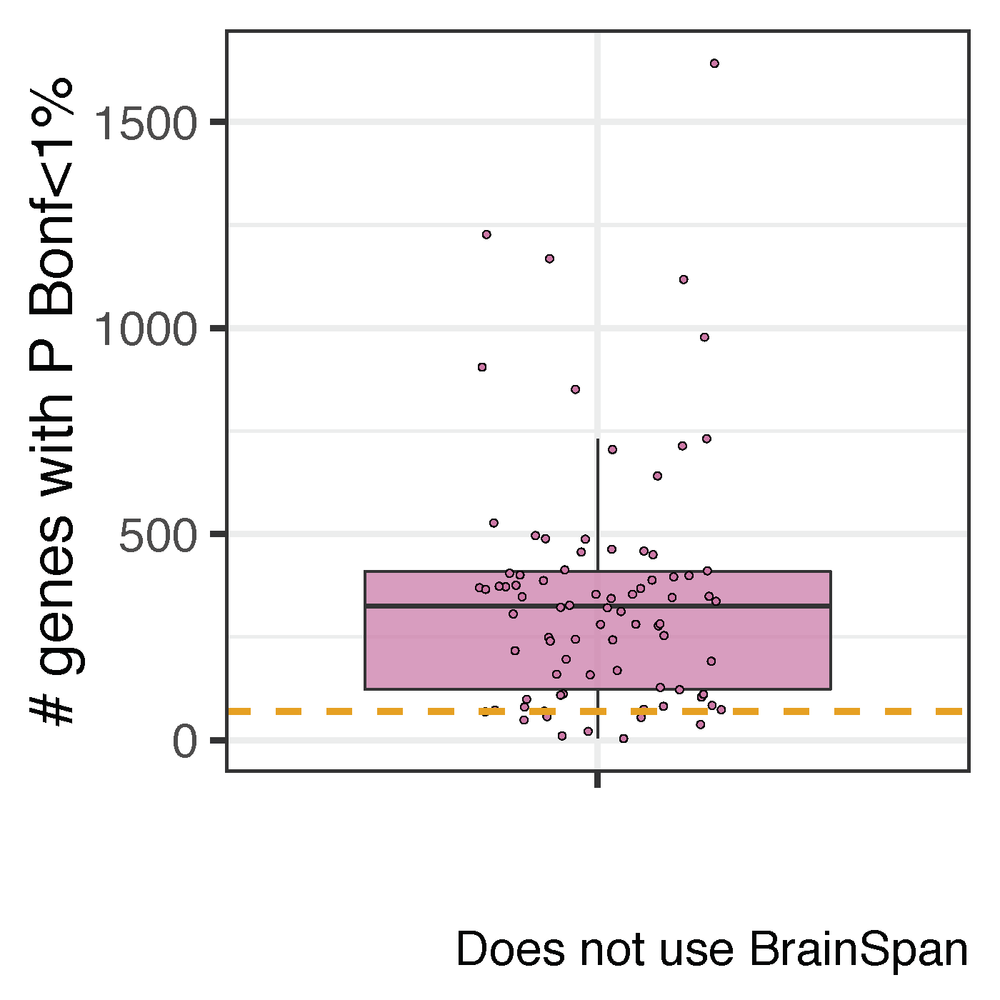
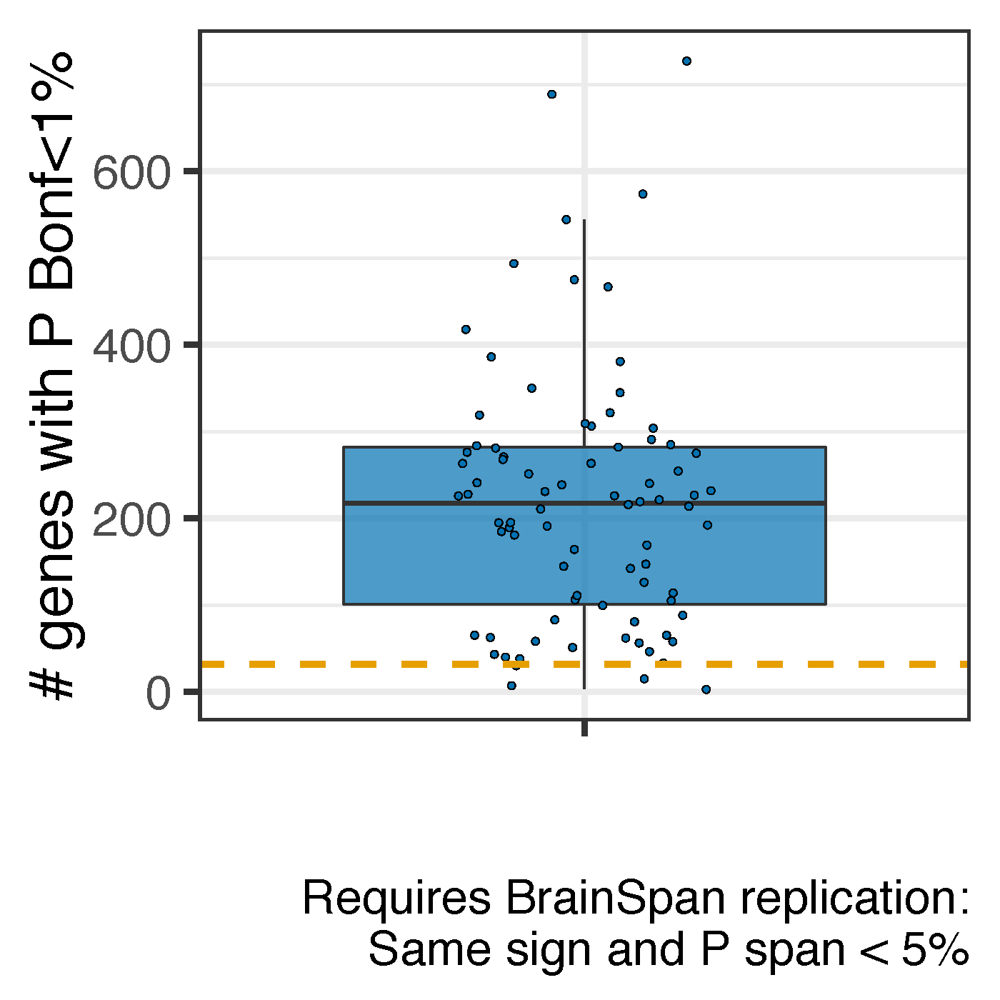

Sample size reduction check for adult genes
===========================================

In the prenatal regional analyses, we used 28 samples per brain region (56 total) for our gene differential expression analysis across DLPFC and HIPPO. To evaluate the scenario where we had a reduced number of adult samples, we sub-sampled the adult samples to the same number of prenatal samples (28 per brain region). Out the 100 sub-sampled iterations, 82 resulted in tractable models using our original differential expression methods, and we observed 70 genes in prenatal samples with bonferroni-adjusted p-values less than 1%, out of which 32 replicated in BrainSpan (same t-statistic sign and a p-value <5% in BrainSpan). Across our 82 sub-sampled replicates, we observed a mean of 353.9 genes with P-bonferroni <1% with an average of 217.9 genes also replicating in BrainSpan. These averages are significantly higher than 70 P-bonferroni <1% in prenatal (p=5.08e-13) and 32 that further replicated in BrainSpan (p=3.06133e-18).

Thus, while it’s true that our prenatal analyses involve a smaller sample size, the differences between DLPFC and HIPPO are more widespread in adults than prenatal individuals when considering the same number of subjects, with or without assessing replication in BrainSpan. These analyses further suggest that more pronounced differences in cellular composition in the adult brain compared to the prenatal brain. 

## Plots

The plots below show the number of genes with P-bonferroni <1% between DLPFC and HIPPO in the 82 adult sub-sampled gene-level analyses. The orange lines denote the number of genes in our prenatal gene analysis with P-bonferroni <1%.

This second plot requires that the signal is replicated in BrainSpan (without sub-sampling BrainSpan).

