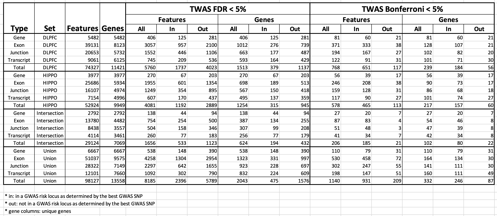
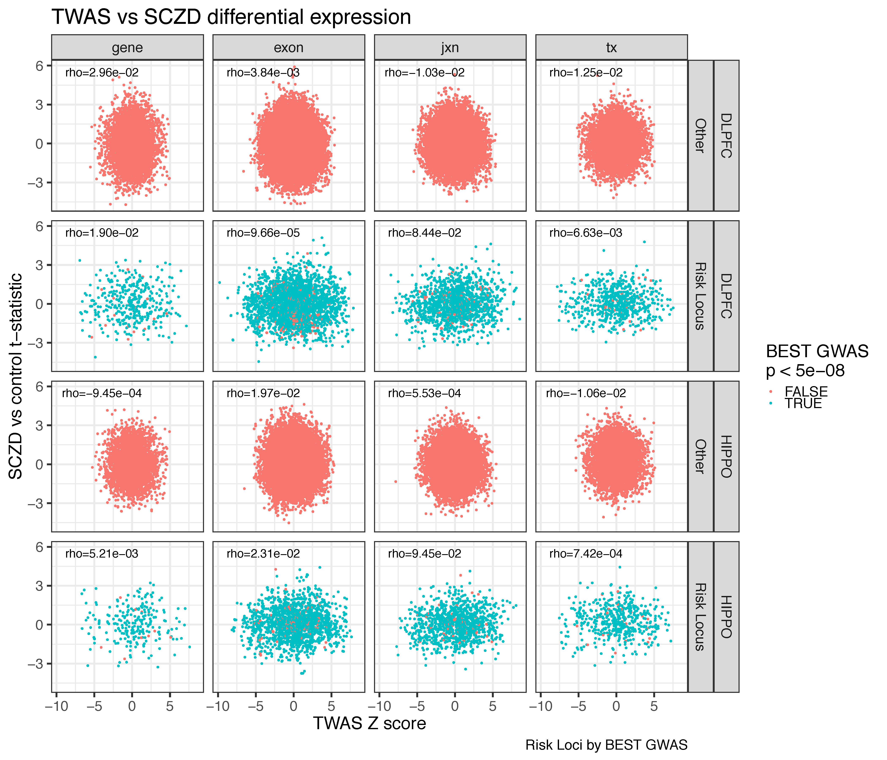
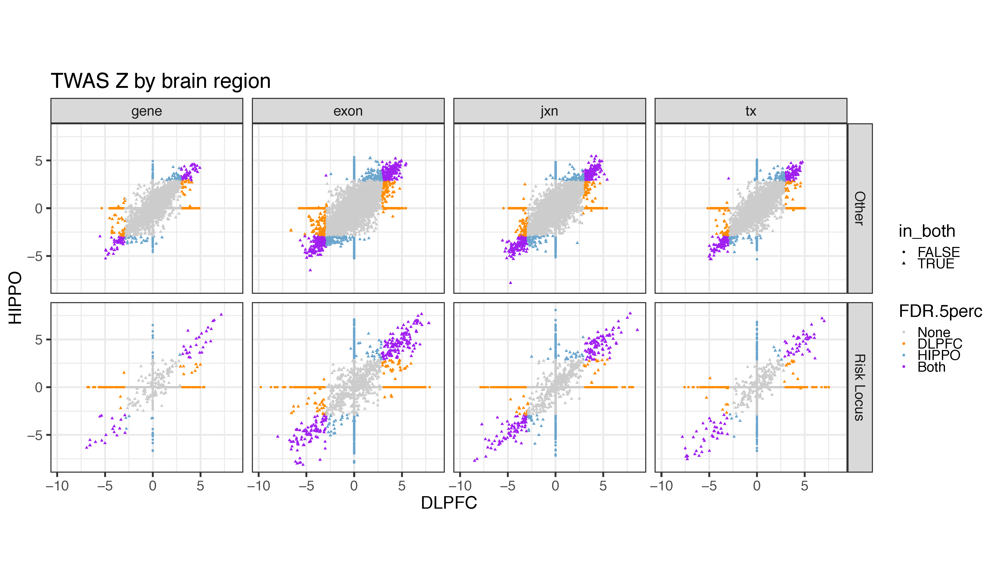
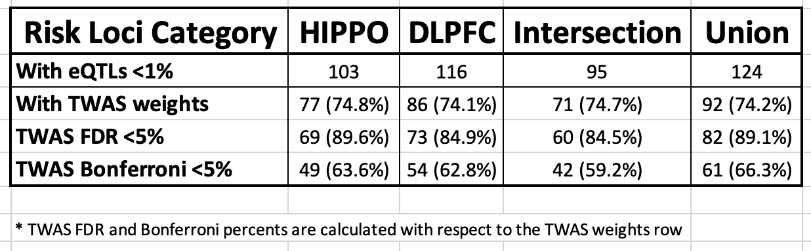

TWAS with hg38 weights
======================


# Homogenizing SNPs

There are three set of SNP files each with coordinates in a given version of the genome and with IDs that need to be homogenized. This step takes a while and can lead to dropping some SNPs. The three sets are:

* The reference LD set of SNPs
* The SNPs you want to use to build the gene (feature) weights
* The GWAS summary statistic SNPs

## LD set

The LD reference set can be obtained from http://gusevlab.org/projects/fusion/ as described in their [instructions](http://gusevlab.org/projects/fusion/#computing-your-own-functional-weights). Here we downloaded them with the following code in the [filter_data/filter_snps.R script](https://github.com/LieberInstitute/brainseq_phase2/blob/master/twas/filter_data/filter_snps.R#L20-L32).

The LD reference set of SNPs uses hg19 coordinates and their own set of SNP IDs (names) that don't match ours. So, the script [reference_hg38/port_to_hg38.R](https://github.com/LieberInstitute/brainseq_phase2/blob/master/twas/reference_hg38/port_to_hg38.R) uses our SNP map data (hg19 to hg38 map) to first find those SNPs that match ours by chromosome and position (in hg19 coordinates) to then update their coordinates to hg38 and then update their IDs. Most of that is done in the earlier half of the [script](https://github.com/LieberInstitute/brainseq_phase2/blob/master/twas/reference_hg38/port_to_hg38.R#L37-L90).

## Weight SNPs

The SNPs we are using to calculate the TWAS weights is the set we used for computing eQTLs. These SNP files however are in hg19 coordinates in the [plink](https://www.cog-genomics.org/plink2/)-formatted files (check the `.bed`, `.bim` and `.fam` trio of files that are part of a `plink` set [here](https://www.cog-genomics.org/plink/1.9/formats)), so we need to update them to hg38. In addition, we need to filter them to consider those present in the LD reference set. All of this is done in the [filter_data/filter_snps.R script](https://github.com/LieberInstitute/brainseq_phase2/blob/master/twas/filter_data/filter_snps.R).

First we load the set of LD reference SNPs that have hg38 coordinates but that are still in hg19 coordinates [here](https://github.com/LieberInstitute/brainseq_phase2/blob/master/twas/filter_data/filter_snps.R#L38-L46). Next, we [filter our set](https://github.com/LieberInstitute/brainseq_phase2/blob/master/twas/filter_data/filter_snps.R#L57-L114) of SNPs to the reference LD set. Next, we [make new plink sets](https://github.com/LieberInstitute/brainseq_phase2/blob/master/twas/filter_data/filter_snps.R#L116-L174) for each brain region and make sure that the plink files have hg38 coordinates.


## GWAS summary SNPs

### PGC2

The example summary SNPs from the [main TWAS-fusion documentation](http://gusevlab.org/projects/fusion/#typical-analysis-and-output) uses a set of [PGC2 schizophrenia GWAS](https://data.broadinstitute.org/alkesgroup/FUSION/SUM/PGC2.SCZ.sumstats) summary statistics that we downloaded at [pgc_scz2_sumstats directory](https://github.com/LieberInstitute/brainseq_phase2/tree/master/twas/pgc_scz2_sumstats). We first used this set to make sure everything was working. Since this set is in hg19 coordinates and uses the same IDs as in the reference LD set, the second half of [reference_hg38/port_to_hg38.R script](https://github.com/LieberInstitute/brainseq_phase2/blob/master/twas/reference_hg38/port_to_hg38.R#L129-L169) deals with converting them to hg38 and to use our SNP IDs.

### PGC2+CLOZUK

A second set of GWAS summary statistics is available via the [Walters Group Data Repository](http://walters.psycm.cf.ac.uk/), called the `CLOZUK+PGC2 meta-analysis summary statistics`. This summary statistic file is in a different format from the one needed for the TWAS fusion code. For reasons like this, the [main TWAS-fusion documentation](http://gusevlab.org/projects/fusion/#typical-analysis-and-output) suggests using the `LDSC munge_stats.py` script available at [bulik/ldsc](https://github.com/bulik/ldsc). The code for downloading this set of summary SNPs and converting the statistics to the TWAS-fusion required format is at [psycm/download.sh](https://github.com/LieberInstitute/brainseq_phase2/blob/master/twas/psycm/download.sh). 

Having downloaded the CLOZUK+PGC2 summary statistics (from `psycm`, hence the name), the script [psycm/convert_to_hg38.R](https://github.com/LieberInstitute/brainseq_phase2/blob/master/twas/psycm/download.sh) uses our SNP map data to convert this set of summary SNPs to hg38 coordinates and to use our SNP names. Note that some of the entries in the summary file are not SNPs, but insertions, deletions, inversions as shown [here](https://github.com/LieberInstitute/brainseq_phase2/blob/master/twas/psycm/convert_to_hg38.R#L50). Ultimately, a bit less than one fourth of the SNPs that match to hg38 are present in the LD reference set (check [here](https://github.com/LieberInstitute/brainseq_phase2/blob/master/twas/psycm/convert_to_hg38.R#L120)).


# Computing weights

Now that we have SNPs in the same genome version and with the same IDs (this is all information that TWAS-fusion uses at some point), we can compute weights for our genes (or features). The [compute_weights.R script](https://github.com/LieberInstitute/brainseq_phase2/blob/master/twas/compute_weights.R) does this for both brain regions using multiple cores. The process involves subsetting our hg38 SNP `plink` files (the weight SNPs), replacing the phenotype `plink` data column with the gene expression values and then running the TWAS-fusion `FUSION.compute_weights.R` script. Most of this is done in a [parallelized function](https://github.com/LieberInstitute/brainseq_phase2/blob/master/twas/compute_weights.R#L197-L260). Once all the weights have been computed, we need to [create a profile](https://github.com/LieberInstitute/brainseq_phase2/blob/master/twas/compute_weights.R#L270-L278) using TWAS-fusion `FUSION.profile_wgt.R` (this creates a `wglist_summary.txt` that we rename) and then a [position file for each of the features](https://github.com/LieberInstitute/brainseq_phase2/blob/master/twas/compute_weights.R#L280-L315). It's important to note that the code uses `data.table` which can request too many cores (more than the ones we allocated) and lead to some `libgomp` errors. Hence, it's crucial to use `setDTthreads(threads = 1)` early to avoid this problem and also reduce the memory blow up as was done [here](https://github.com/LieberInstitute/brainseq_phase2/blob/master/twas/compute_weights.R#L13-L17). The bash script [compute_weights.sh](https://github.com/LieberInstitute/brainseq_phase2/blob/master/twas/compute_weights.sh) creates the different scripts for each feature (gene, exon, jxn, tx) with the amount of memory per core that we observed in some tests was needed for them.


# Using the weights

Once the weights have been created, the [apply_weights.sh](apply_weights.sh) script runs two TWAS-fusion scripts: `FUSION.assoc_test.R` and `FUSION.post_process.R` that are described in the [main documentation](http://gusevlab.org/projects/fusion/#typical-analysis-and-output). Note that `FUSION.post_process.R` uses the `glist` (gene list) information for making the plots that we have only created for genes so far (see the end of this document).

The [test_analysis.R](test_analysis.R) code includes some earlier versions of the code used for writing `apply_weights.sh` and checking some of the results. It was useful in finding a few bugs/issues that have hopefully resolved.


# JHPCE modules

## plink

We created a JHPCE module such that you can use the latest (at the time of writing this document) `plink` version.

```bash
module load plink/1.90b6.6
```

The installation code we used is documented at [jhpce_mod_source](https://github.com/LieberInstitute/jhpce_mod_source/tree/master/plink/1.90b6.6) and the actual `.lua` file is located at [jhpce_module_config](https://github.com/LieberInstitute/jhpce_module_config/blob/master/plink/1.90b6.6.lua).

## `fusion_twas`

```bash
module load fusion_twas/github
```

The installation code we used is documented at [jhpce_mod_source](https://github.com/LieberInstitute/jhpce_mod_source/tree/master/fusion_twas/github) and the actual `.lua` file is located at [jhpce_module_config](https://github.com/LieberInstitute/jhpce_module_config/blob/master/fusion_twas/github.lua).


### Details

The original `fusion_twas` scripts are located at [gusevlab/fusion_twas](https://github.com/gusevlab/fusion_twas). Given the amount of changes needed for using this code in hg38 instead of hg19, we made a fork that is available at [LieberInstitute/fusion_twas](https://github.com/LieberInstitute/fusion_twas). You can use the GitHub compare tool to [inspect all the differences](https://github.com/gusevlab/fusion_twas/compare/master...LieberInstitute:jhpce). We basically have added the following:

* Some debugging code
* A set of hg38 genes with Gencode IDs and the ability to specify the input gene file.
* Resolved together with the TWAS-fusion maintainer some issues/bugs(?) reported in [issue number 4](https://github.com/gusevlab/fusion_twas/issues/4).
* Changed the name of the summary file to `wglist_summary.txt`, so we can then rename it as needed.

# BSP2 CLOZUK+PGC2 TWAS BSP2 results

We have now more formally integrated GWAS and eQTL statistics by performing a transcriptome-wide association study (TWAS) ([Gusev et al, Nature Genetics, 2016](https://www.ncbi.nlm.nih.gov/pubmed/26854917)). We constructed SNP weights across the four feature summarizations (gene, exon, junction and transcript) using both brain regions (DLPFC and HIPPO) and applied these weights to the summary statistics from the entire collection of schizophrenia GWAS summary statistics from PGC2+CLOZUK ([Pardiñas et al, Nature Genetics, 2018](https://www.nature.com/articles/s41588-018-0059-2)). We identified widespread TWAS associations to be genome-wide significant and marginally significant GWAS risk loci, including 8,185 features (538 genes, 4,258 exons, 2,297 junctions and 1,092 transcripts, see Table 1 below) significantly associated with schizophrenia risk with TWAS FDR < 5% that were annotated to 2,044 unique genes in either brain region. We also associated the TWAS Z scores across all heritable features with the corresponding differential expression t-statistic for schizophrenia in either brain regions, and found no correlation (Figure 1 below). These results suggest that genetic risk and illness state likely impart orthogonal signal on the transcriptome, where the latter likely reflects the consequences, and not causes, of illness. This point was previously raised in [Jaffe et al, Nature Neuroscience, 2018](https://www.nature.com/articles/s41593-018-0197-y), and has been strengthened by these TWAS results. 

## Details

We identified 8,185 features (538 genes, 4,258 exons, 2,297 junctions and 1,092 transcripts, see Table 1 below) significantly associated with schizophrenia risk with TWAS FDR < 5% that were annotated to 2,044 unique genes, of which 1,140 features (110 genes, 530 exons, 302 junctions and 198 transcripts) in 333 genes were significant following more conservative Bonferroni adjustment (at < 5%) in either brain region. As the TWAS approach combines GWAS and eQTL information, it's possible for GWAS signal that does not reach GWAS genome-wide significance (p < 5e-8) to still achieve TWAS transcriptome-wide significance. We therefore annotated the strongest GWAS variant for each significant TWAS feature back to the clumped GWAS risk loci, and found that 77.7% of the TWAS Bonferroni-significant features (N=931) mapped back to the published GWAS risk loci. While a small fraction of Bonferroni-significant TWAS features were outside of GWAS risk loci (N=209 features, 18.3%), a much larger fraction of FDR-significant TWAS features identified potentially novel genes and corresponding GWAS loci implicated in schizophrenia (N=5,789 features, 70.7% corresponding to 1,576 genes - 77.1%).

When comparing DLPFC versus HIPPO, more features were heritable and have TWAS weights in DLPFC (74,327 features spanning 11,421 genes, see Table 1) than HIPPO (52,924 features spanning 9,949 genes). This lead to more TWAS genome wide significant (FDR<5%) features for DLPFC (5,760 features spanning 1,513 genes) than HIPPO (4,081 features spanning 1,254 genes) with 1,656 features (20.2%) spanning 624 genes (30.5%) being significant in both brain regions. The TWAS Z scores were highly correlated (0.86 to 0.93 by brain region, feature and risk loci status) and concordant (only 2 were discordant) among DLPFC and HIPPO for the features with TWAS weights in both brain regions (see Figure 2 below). The TWAS approach is complementary to the eQTL analysis we carried out on risk loci as 92 (74.2%) of the 124 risk loci with eQTLs at FDR<1% we identified successfully had TWAS weights (see Table 2 below). Of these risk loci with TWAS weights, 82 (89.1%) across both brain regions had a feature with genome wide significant TWAS signal at FDR <5% (N=61 for Bonferroni <5%, 66.3%). We further compared our results against the TWAS published by Gusev et al, Nature Genetics, 2018. They identified 83 unique genes with TWAS Bonferroni <5% across the CMC and CMC splicing datasets. In our TWAS analysis, we replicated 70 (84.3%) with TWAS FDR <5% and 56 (67.5%) with TWAS Bonferroni <5% across any of the expression feature levels we assessed (see Table 3 below).


## _Table 1_



Number in this table are also shown in several of the `pdf/venn_feature*.pdf` files.

## _Figure 1_



TWAS Z statistic vs SCZD t-statistic.

## _Figure 2_



Correlations for the plot above (only using points present in both regions):

```{r}
corrs
# $gene
#     Other Risk Loci
# 0.8580300 0.9153703
#
# $exon
#     Other Risk Loci
# 0.8666640 0.8951267
#
# $jxn
#     Other Risk Loci
# 0.8786717 0.9278632
#
# $tx
#     Other Risk Loci
# 0.8766659 0.9285188
```

## _Table 2_



## _Table 3_

```{r}
with(gusev_gene, addmargins(table(psycm_FDR_DLPFC_any_feature, psycm_FDR_HIPPO_any_feature)))
#                            psycm_FDR_HIPPO_any_feature
# psycm_FDR_DLPFC_any_feature FALSE TRUE Sum
#                       FALSE    13    4  17
#                       TRUE     15   51  66
#                       Sum      28   55  83

with(gusev_gene, addmargins(table(psycm_Bonf_DLPFC_any_feature, psycm_Bonf_HIPPO_any_feature)))
#                             psycm_Bonf_HIPPO_any_feature
# psycm_Bonf_DLPFC_any_feature FALSE TRUE Sum
#                        FALSE    27    5  32
#                        TRUE     20   31  51
#                        Sum      47   36  83
```


## Analysis steps

* [`explore_twas.R`](https://github.com/LieberInstitute/brainseq_phase2/blob/master/twas/explore_twas.R#L1-L122) creates the `rda/twas_exp.Rdata` file by reading in all the output TWAS files and adding feature level information. This script actually reads in all the files from both the CLOZUK+PGC2 TWAS as well as the PGC2 TWAS analyses we ran.
* [`explore_twas_psycm.R`](https://github.com/LieberInstitute/brainseq_phase2/blob/master/twas/explore_twas_psycm.R) focuses on the CLOZUK+PGC2 TWAS. It reads in the functions we wrote for exploring either set of TWAS saved in [`twas_functions.R`](https://github.com/LieberInstitute/brainseq_phase2/blob/master/twas/twas_functions.R). This script ultimately makes the correlation summary table and has other explorations we carried out. 
* For PGC2 TWAS, check [`explore_twas_pgc2.R`](https://github.com/LieberInstitute/brainseq_phase2/blob/master/twas/explore_twas_pgc2.R). Something exclusive to this script is that it creates `rda/gusev_gene.Rdata` which shows whether any of the 83 unique genes identified by Gusev et al, Nature Genetics, 2018 in either `CMC` or `CMC_splicing` are present in our TWAS results.
